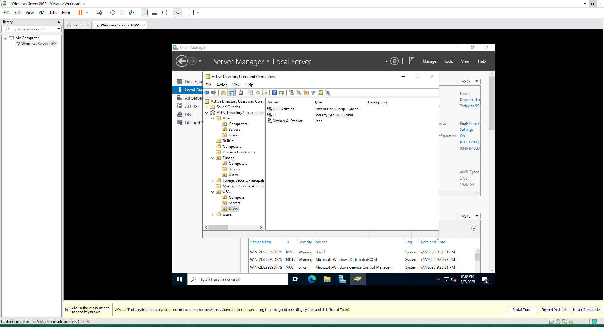
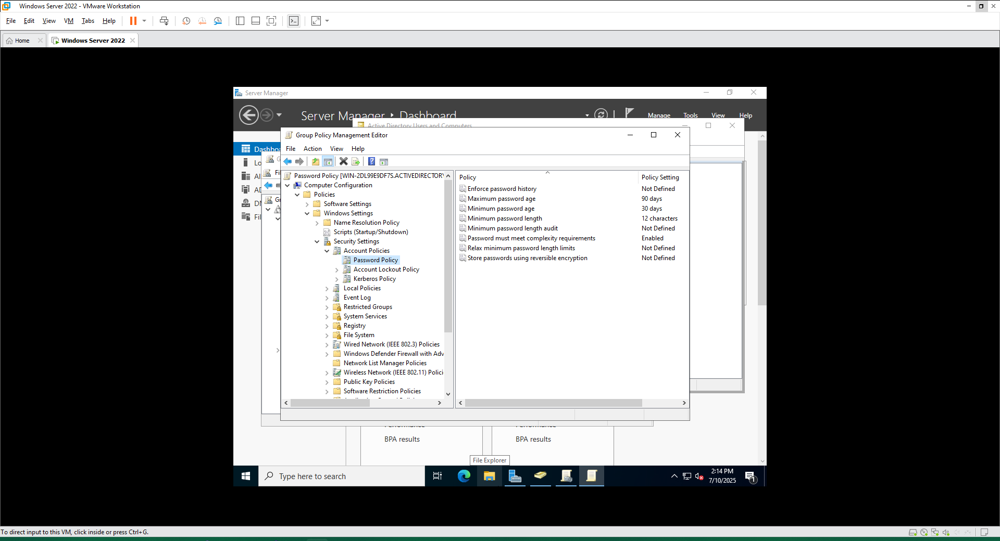
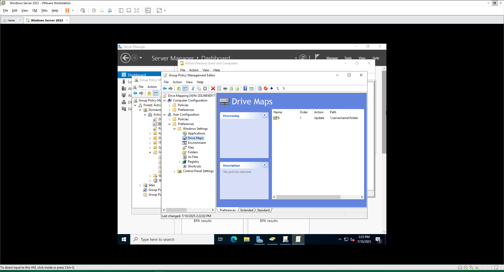

# Active Directory Lab

___Start Date: 6 July 2025___

___End Date: current___

## Objective

Learn basic functions in Active Directory such as creating and modifying groups, users, and devices as well as applying policies and more.

## Setup

1. Created a virtual machine (VM) using VMWare Workstation Pro.[^1]
2. Installed Microsoft Server 2022 on the VM. [^2]
3. Added Active Directory as a feature on the server using Server Manager.

## Key Concepts Learned

- Adding and utilizing Active Directory on Windows Server.
- Creating Organizational Units (OUs) and adding objects to them such as Users, Computers and Servers. [1]
- Creating Security groups.
- Creating Distribution groups.
- Creating Group Policy Objects (GPOs) including: password policies [2], drive mapping preferences [3]

## Secondary Concepts Learned

- Utilizing a VM environment through VMWare.
- Installing Windows Server 2022 on a VM.
- Utilizing Server Manager on Windows Server to manage services and features.
- Creating documentation files using markdown.
- Utilizing Git and GitHub to document changes

## Challenges, Bugs & Fixes

## Files

## Next Steps

## Screenshots

[1] 
[2] 
[3] 

[^1]: Obtained access for VMWare through [Broadcom's][broadcom] free personal/educational access.
[^2]: Obtained a [180-day evaluation copy][microsoft-server] for Windows Server 2022.

[broadcom]: https://knowledge.broadcom.com/external/article?articleNumber=368667
[microsoft-server]: https://www.microsoft.com/en-us/evalcenter/evaluate-windows-server-2022