# Page Links

[README](../README.md) | [Screenshots](./screenshots.md) | [Change Log](./change-log.md) | [Research](./research.md) | [Troubleshooting](./troubleshooting.md) | [To Do](./to-do.md)

# Screenshots

#### a 
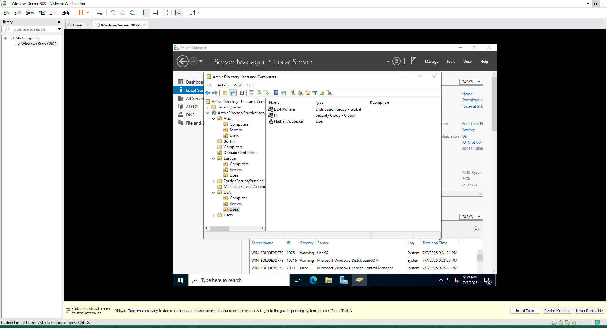

#### b
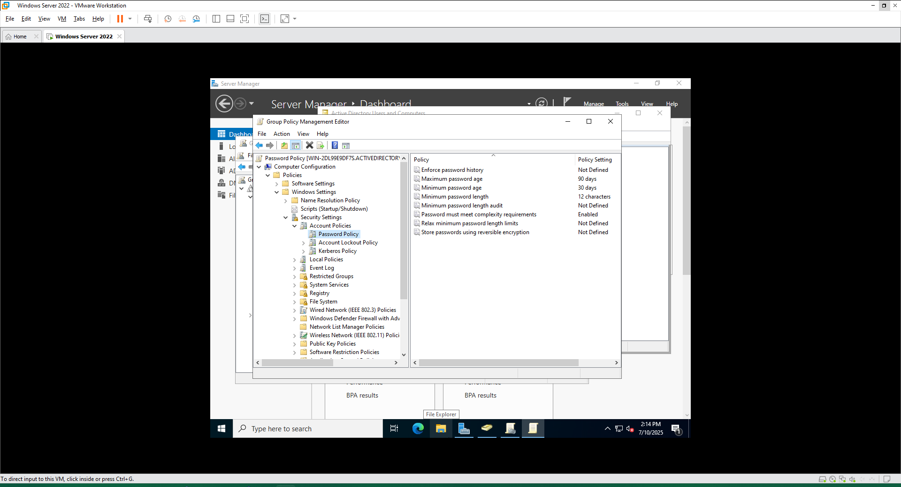

#### c
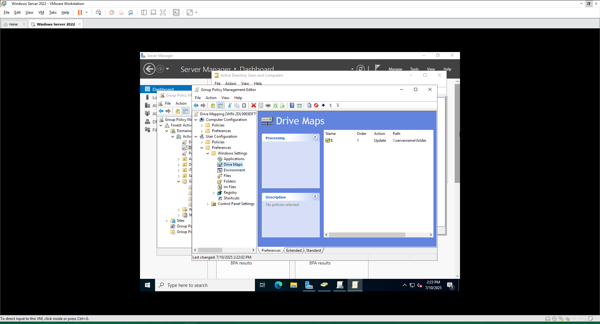

#### d
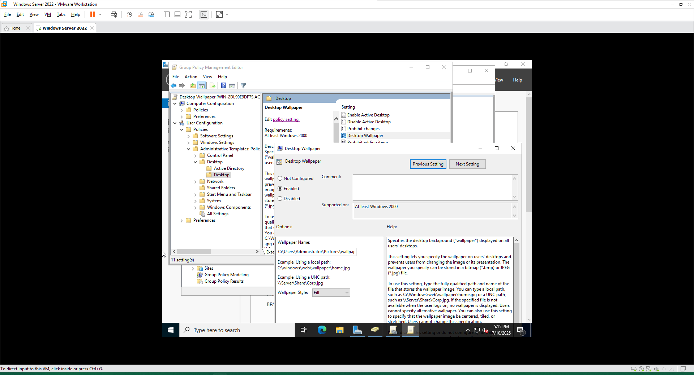

#### e
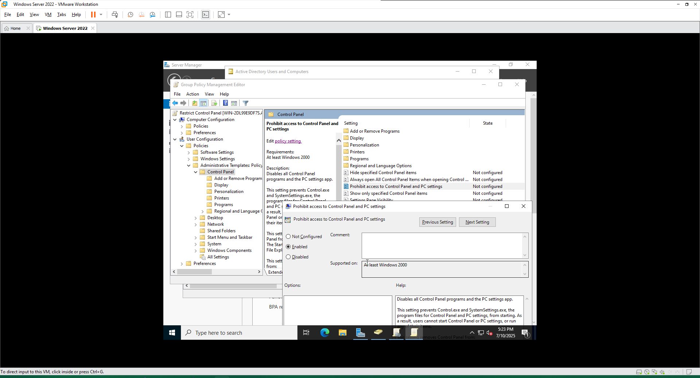

#### f
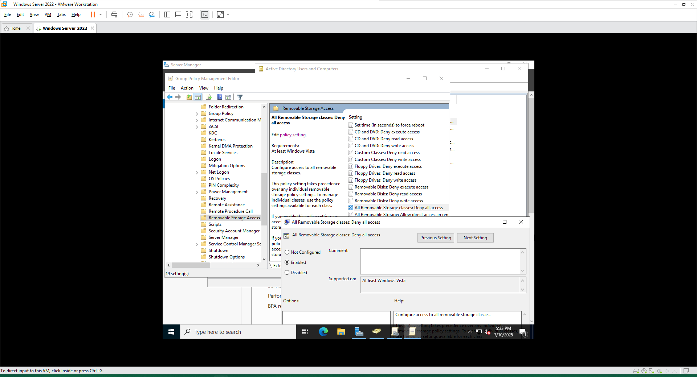

#### g
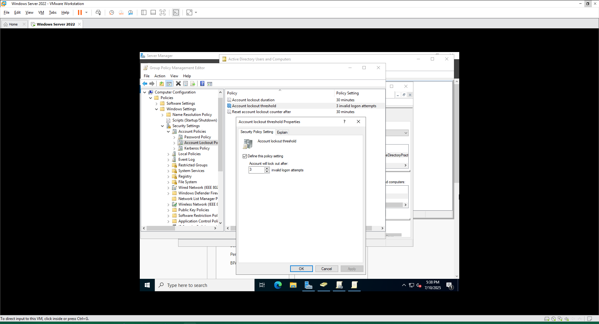

#### h
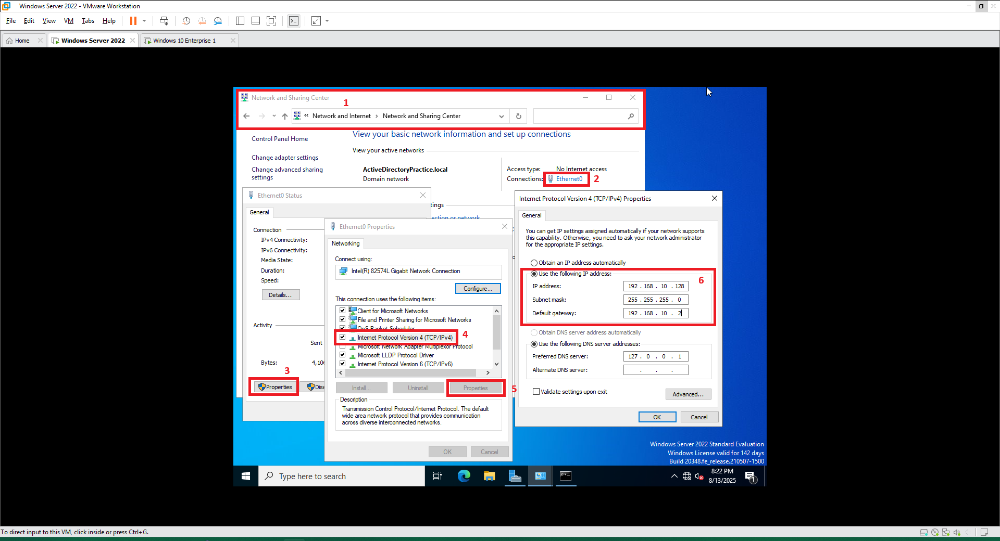
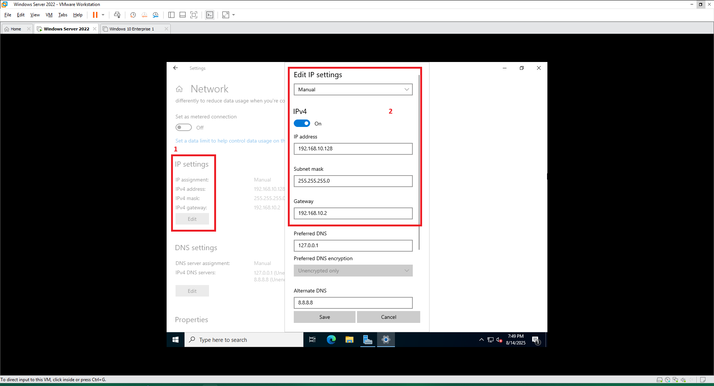

#### i
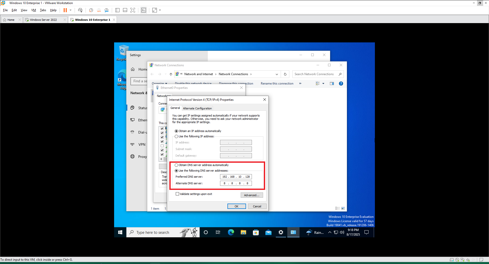

#### gpo-troubleshooting-a
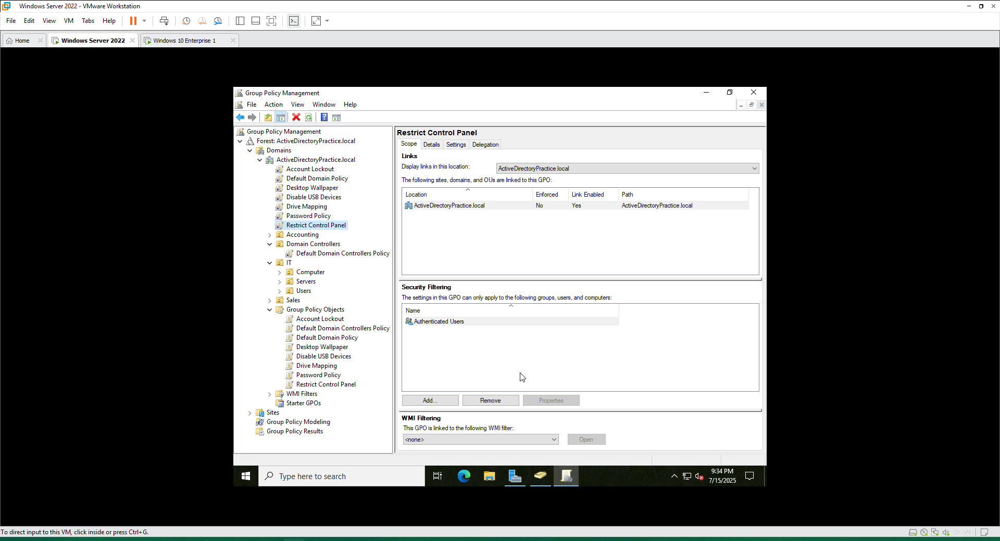

#### gpo-troubleshooting-d
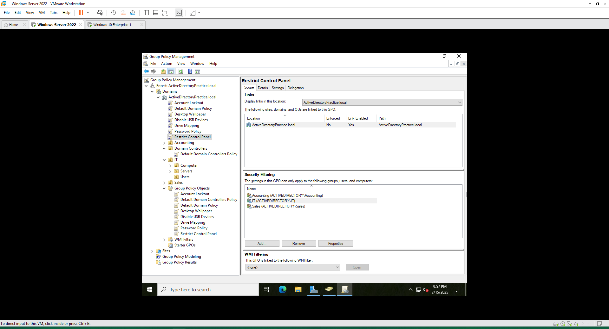

#### network-troubleshooting
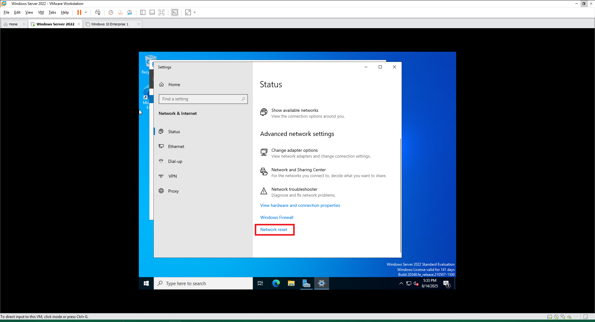

#### ipv4-manual-config-troubleshooting

#### domain-dns-troubleshooting
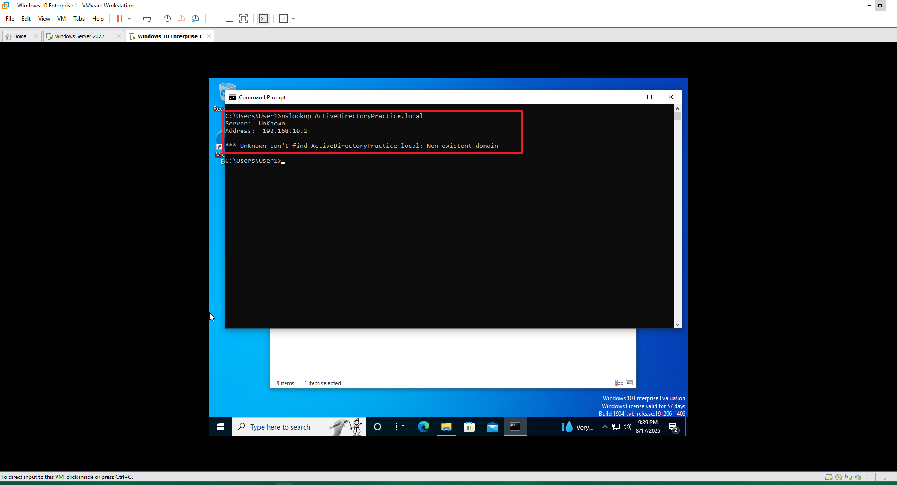

#### domain-dns-troubleshooting-3
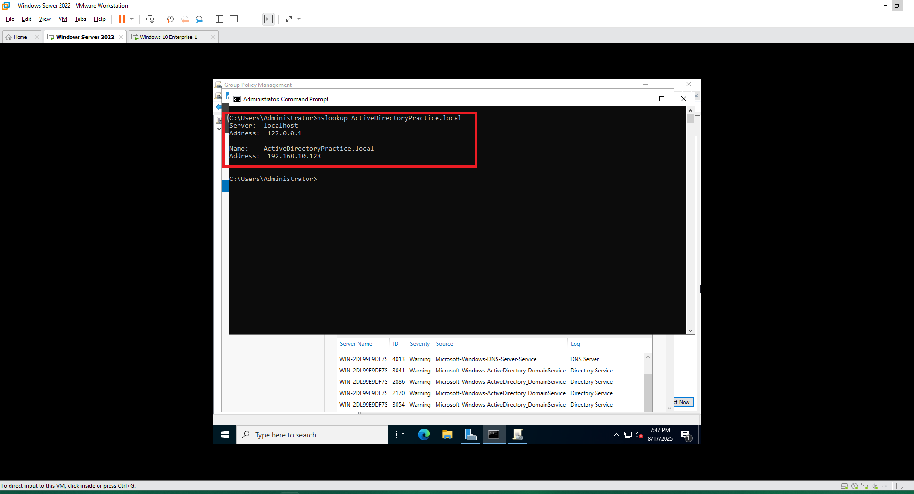

#### domain-dns-troubleshooting-4a
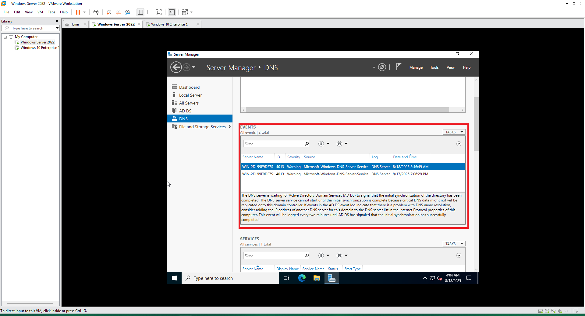